<div align="center">

# deckify

### PPT just turned the page. AI takes the canvas from here — in HTML, where stories run further.

> deckify turns any brand's website into a reusable Design System — every deck from here on is AI's job, not yours.

[**English**](README.md) · [中文](README.zh.md)

</div>

---

## What deckify does

You give deckify any brand's website. A few minutes later you have **two things that compound**:

1. **A complete Design System** — the brand's colors, fonts, logo, voice, plus the engineering rules every slide should follow. Saved as one `.md` file. Hand it to any AI agent, anywhere, anytime.
2. **A 9-slide demo deck** — already in that brand's visual language. Living HTML, opens in any browser. Proves the spec works.

The first one is the asset that compounds. Every future deck gets generated from it — by AI, in HTML, in seconds. No design skills required. No PowerPoint required. No template to fight with.

```
You:    use deckify on https://www.tiffany.com
deckify: ... reads tiffany.com like a designer would
         ... extracts colors, fonts, logo, mood
         ... writes a Design System
         ... builds a 9-slide deck in Tiffany's visual language
         ... checks its own work, fixes anything off
         ✓ Done. Open ~/deckify/decks/tiffany/tiffany-deck.html
```

---

## What makes deckify different

### 1. It learns your brand by looking, not by prompting

deckify visits the brand website like a designer would — clicks through the home page, the about page, the press kit; spots the real logo (not a generic placeholder); reads the real colors and fonts; senses the mood. Most "AI design tools" generate from a prompt; **deckify learns from evidence**.

### 2. It produces a reusable Design System, not a one-off deck

The output is a brand asset, not a single output. Every future deck — for the same brand — is generated by AI from this one Design System file. Update the file once, and every downstream deck moves with it. Slides stop being one-off creations and start being **derived from a brand spec**.

### 3. It checks its own work — then fixes itself

After deckify produces the slides, it doesn't just say "done". It runs **11 automatic checks** ("Are the dimensions right?" "Is the logo actually visible?" "Will it look OK on a phone?") and then **judges its own output** against 6 visual standards ("Does it feel on-brand?" "Is the typography balanced?" "Does the content read well?"). If something scores low, it rewrites the part that's wrong and runs the checks again. The deck you see is what deckify believed was good enough to ship.

### 4. It knows what should never change

Designing slides has rules: logo must show on every slide; text below 12 px is unreadable; mobile must collapse to a single column. Most AI slide generators re-learn these the hard way each time. deckify bakes 40+ of these rules into its core; only the brand-specific stuff (colors, fonts, mood) varies per brand. Every deck looks like *that brand* but also works as engineering — on desktop, on mobile, on a projector, on a print.

---

## See it in action

Eight reference brands, every one passing both machine checks and visual review. Open the HTML files in your browser to flip through:

### Tiffany & Co. (中文)
*Editorial luxury, Didone serif, restrained Tiffany Blue.*
[Open the deck →](decks/tiffany/) · [DS markdown](decks/tiffany/tiffany-PPT-Design-System.md)

| Cover | Content |
|:---:|:---:|
| 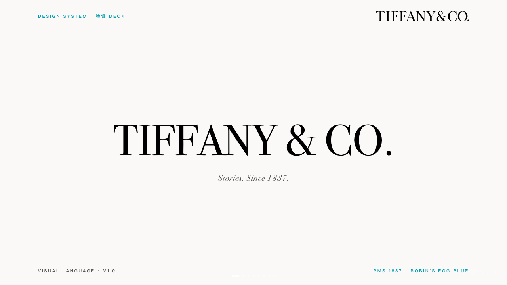 | 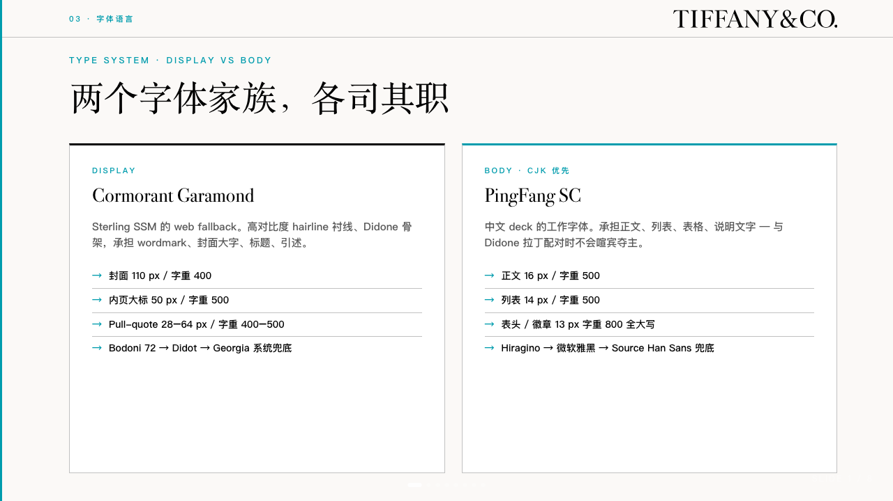 |

### Stripe
*Engineered clarity, Söhne-style sans, bold purple gradient.*
[Open the deck →](decks/stripe/) · [DS markdown](decks/stripe/stripe-PPT-Design-System.md)

| Cover | Content |
|:---:|:---:|
| 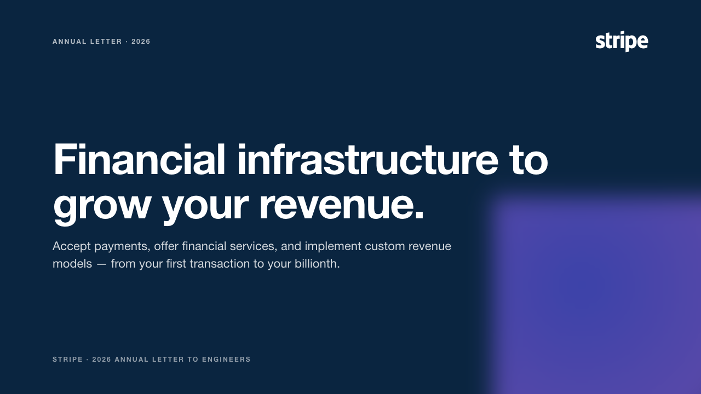 | 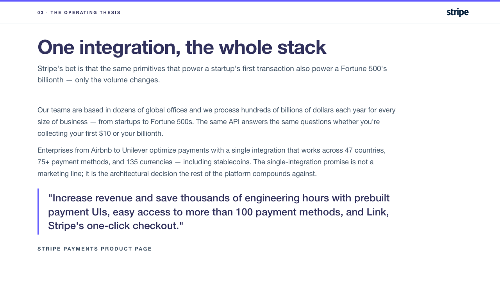 |

### Unilever
*Friendly humanist, sustainability voice, custom font.*
[Open the deck →](decks/unilever/) · [DS markdown](decks/unilever/unilever-PPT-Design-System.md)

| Cover | Content |
|:---:|:---:|
| 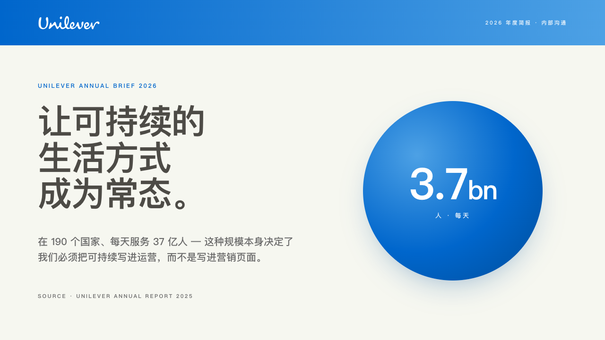 | 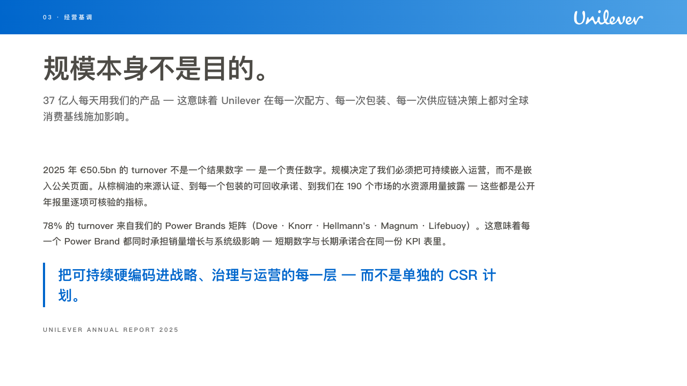 |

### P&G
*Corporate blue, gradient logo badge, generous chrome.*
[Open the deck →](decks/pg/) · [DS markdown](decks/pg/pg-PPT-Design-System.md)

| Cover | Content |
|:---:|:---:|
| 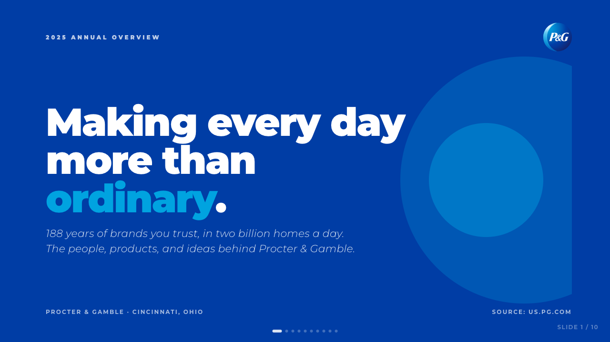 | 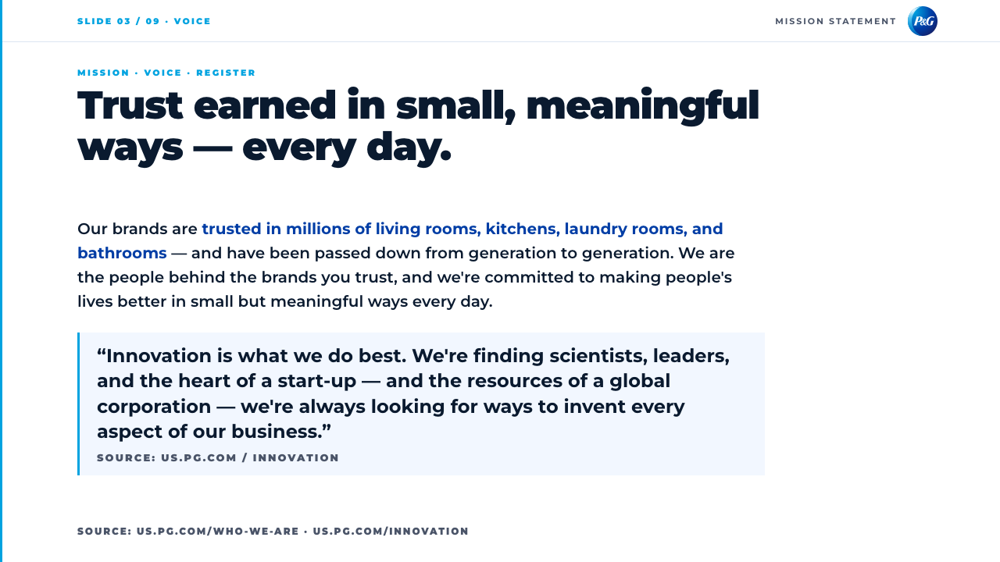 |

### P&G — alternate
*Same brand, different mood; shows what changes when you re-roll the Design System with a different emphasis.*
[Open the deck →](decks/pg-alt/) · [DS markdown](decks/pg-alt/pg-PPT-Design-System.md)

| Cover | Content |
|:---:|:---:|
| 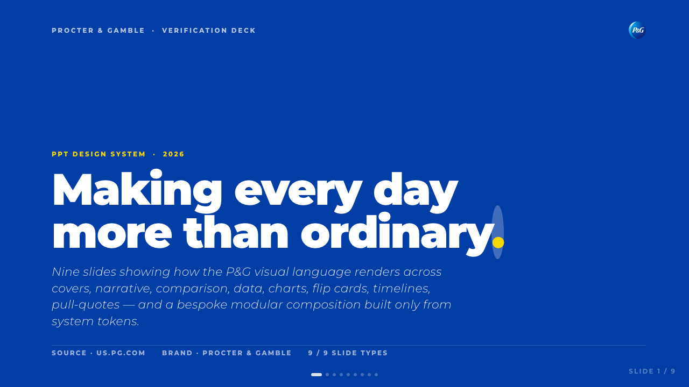 | 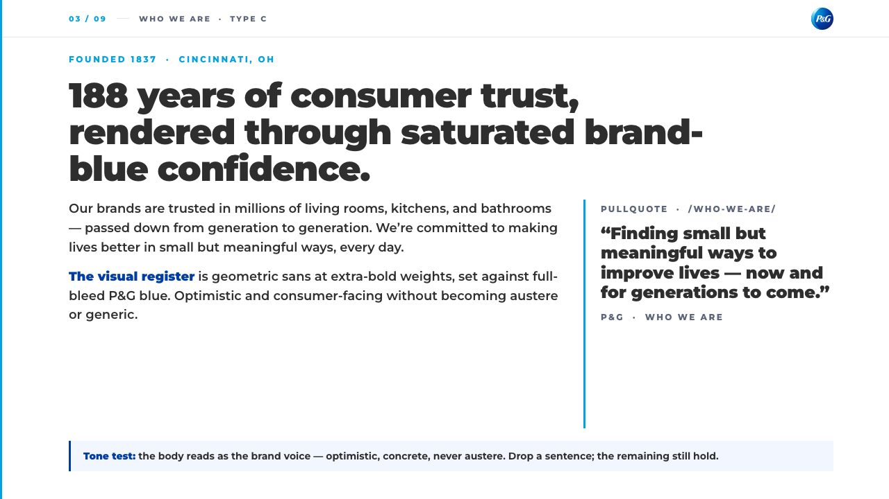 |

### Coca-Cola
*Editorial heritage, Georgia serif, deep red.*
[Open the deck →](decks/coca-cola/) · [DS markdown](decks/coca-cola/coca-cola-PPT-Design-System.md)

| Cover | Content |
|:---:|:---:|
| 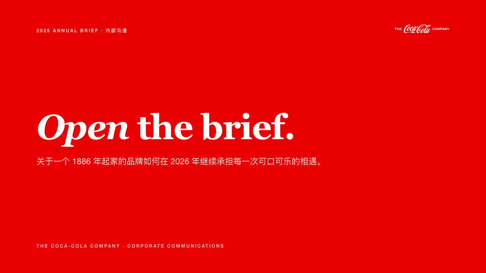 | 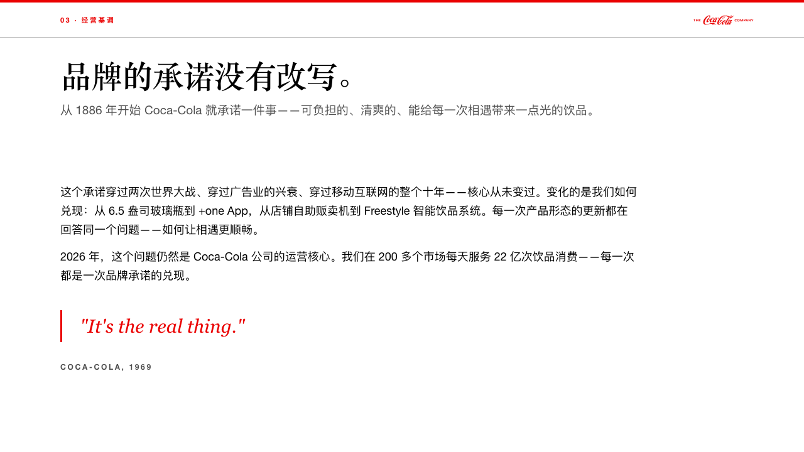 |

### Mars
*Confident corporate, multi-division palette, structured grid.*
[Open the deck →](decks/mars/) · [DS markdown](decks/mars/mars-PPT-Design-System.md)

| Cover | Content |
|:---:|:---:|
| 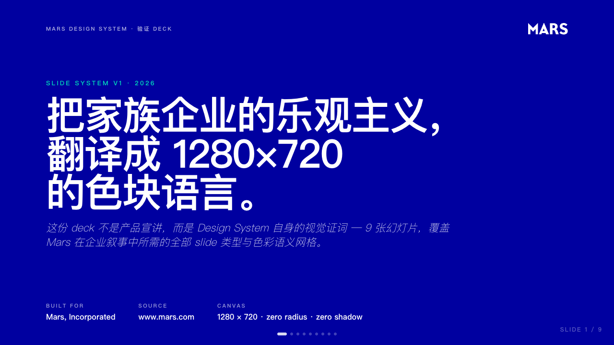 | 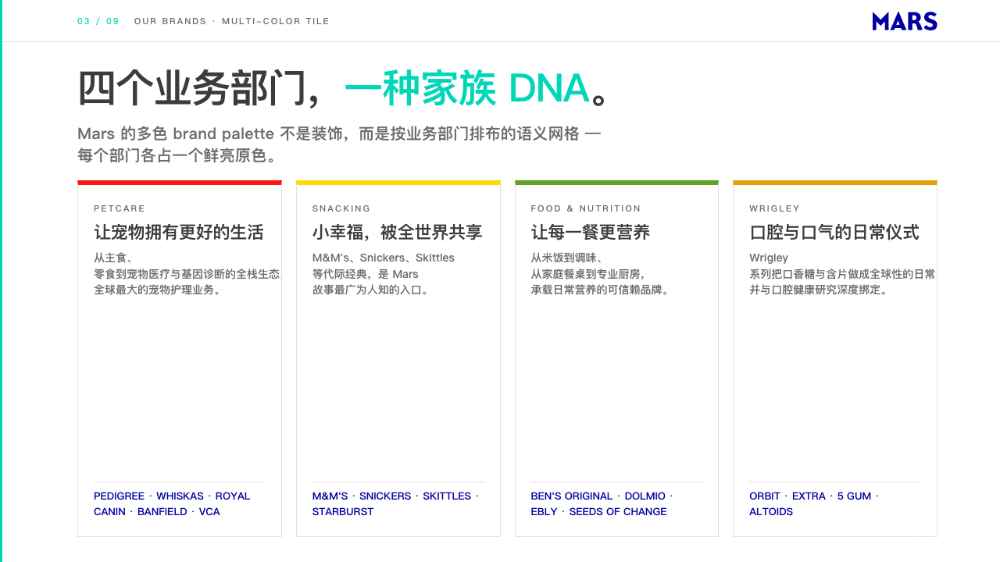 |

### L'Oréal
*French fashion editorial, high-contrast serif, fashion-magazine moments.*
[Open the deck →](decks/loreal/) · [DS markdown](decks/loreal/loreal-PPT-Design-System.md)

| Cover | Content |
|:---:|:---:|
| 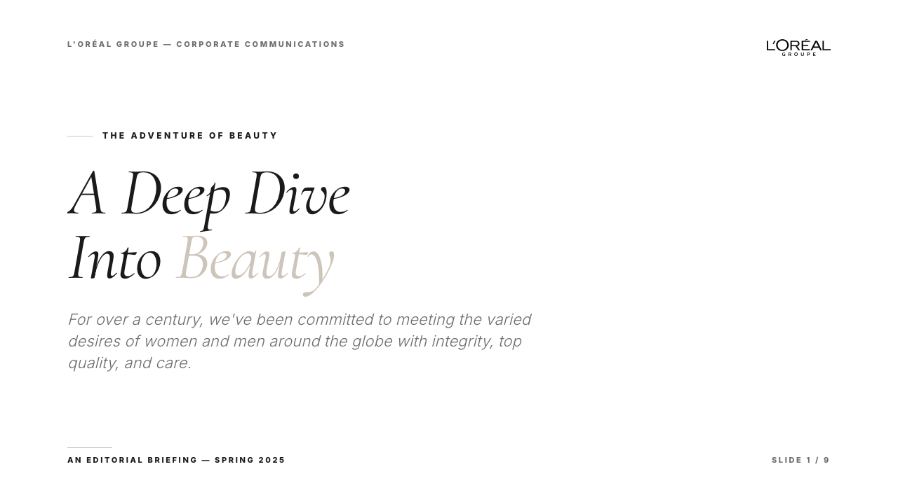 | 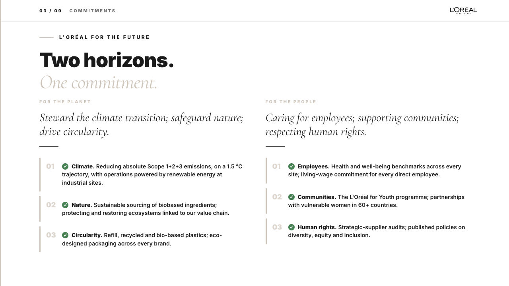 |

---

## Install — paste this to your AI agent

Copy this whole block. Paste it to whichever AI coding agent you use (Claude Code, Codex, OpenClaw, Hermes, Cursor, OpenCode, your own — doesn't matter). Tell it: **"install deckify"**. It'll figure out the rest.

```
👋 Hi agent — the user wants you to install deckify on this machine.

deckify lives at https://github.com/seacen/deckify (a public Git repo)
and ships as a standard "skill / agent prompt" — a SKILL.md plus a
scripts/ folder. Detect your host environment from the cases below
and run the matching install. If your host isn't named, fall through
to the GENERIC case and adapt.

────────────────────────────────────────────────────────────────────
CASE: Claude Code  (you have /skill-creator, /loop, etc.)

    claude plugin marketplace add https://github.com/seacen/deckify
    claude plugin install deckify

────────────────────────────────────────────────────────────────────
CASE: Codex CLI  (you run inside `codex` interactive mode)

    git clone https://github.com/seacen/deckify.git ~/.codex/deckify
    mkdir -p ~/.agents/skills
    ln -sf ~/.codex/deckify/skills/deckify ~/.agents/skills/deckify

────────────────────────────────────────────────────────────────────
CASE: OpenClaw  (your workspace is at ~/.openclaw/workspace/)

    git clone https://github.com/seacen/deckify.git ~/openclaw-deckify
    mkdir -p ~/.openclaw/workspace/skills
    ln -sf ~/openclaw-deckify/skills/deckify ~/.openclaw/workspace/skills/deckify

────────────────────────────────────────────────────────────────────
CASE: GENERIC  (Hermes, OpenCode, Cursor, Continue, Aider, anything else)

    git clone https://github.com/seacen/deckify.git ~/deckify-skill
    # Then either:
    #   (a) symlink ~/deckify-skill/skills/deckify into your host's
    #       skills directory (if your host has one — check its docs),
    #       OR
    #   (b) read ~/deckify-skill/skills/deckify/SKILL.md as a long
    #       system prompt / context attachment when the user invokes
    #       deckify. The skill is self-describing — SKILL.md tells
    #       any agent how to drive it.

────────────────────────────────────────────────────────────────────
AFTER INSTALL: verify the agent-browser dependency

    python3 <install-path>/skills/deckify/scripts/setup.py

If agent-browser is missing the script prints the install command for
the user's platform. Don't make the user fix this manually — run the
install command yourself if you have shell access.

Then ask the user to restart their host so the skill is discovered.
The skill is invokable as: "use deckify on https://example.com".
```

If you'd rather just run the commands yourself, [the per-host blocks are above](#install--paste-this-to-your-ai-agent) — pick yours.

---

## How a run looks

```
You:      use deckify on https://www.your-brand.com

deckify:  (Phase 1) reads the home + 5–8 subpages, takes screenshots,
                    extracts colors / fonts / logo
          (Phase 2) asks you 1–2 short questions where it's genuinely
                    uncertain (language, ambiguous logo, etc)
          (Phase 3) writes ~/deckify/decks/<brand>/<brand>-PPT-Design-System.md
          (Phase 4) builds ~/deckify/decks/<brand>/<brand>-deck.html
          (Phase 5) runs 11 hard checks + scores its own visual quality
          (Phase 6) hands you both files + a one-page summary
```

Total time: **5–10 minutes for most brands**, longer for sites that block bots.

The output goes to `~/deckify/decks/<brand>/`. Always — independent of where you ran the command from.

---

## Where things live on your machine

```
~/deckify/                          ← all your generated brand outputs
└── decks/
    └── <brand>/
        ├── <brand>-PPT-Design-System.md   ← the deliverable
        ├── <brand>-deck.html              ← demo deck, opens in browser
        └── source/                        ← logo, brand profile, picked pages
```

Reports from each run (screenshots, pass/fail logs) go to `~/deckify/reports/runs/<timestamp>/`.

---

## What's in this repo

| Folder | What it is |
|---|---|
| [`skills/deckify/`](skills/deckify/) | The skill itself — what gets installed onto your machine |
| [`decks/`](decks/) | 8 reference brand outputs, kept as study material |
| [`tools/phase-a/`](tools/phase-a/) | Maintainer-only — used to keep the skill in good shape |
| [`TESTING.md`](TESTING.md) | The two-layer testing model (skill quality vs single-deck quality) |

---

## License

[**PolyForm Noncommercial 1.0.0**](LICENSE) — free for personal, educational, research, charitable, and noncommercial use. **Commercial use requires a separate license.** Attribution is required: keep the LICENSE file when redistributing or building on top of deckify.

If you're unsure whether your use is "noncommercial," reach out via a GitHub issue.

---

## Credits

Built by **Xichang (Seacen) Zhao** — [github.com/seacen](https://github.com/seacen).

Engineering DNA distilled from many failed slides. Every line of `references/ds-template.md` came from a real production bug.

---

## One more thing — a note for the AI era

Look at what just happened. You didn't open PowerPoint. You didn't move a single text box. You didn't fight a template. PPT was built **for humans to draw with their hands** — every box, every gradient, every line spacing, hand-placed. That made sense for fifty years.

The job has changed. Slides are no longer drawn — they're imagined and described. The author has shifted from human to AI, and AI's native medium isn't `.pptx` binary — it's HTML. Living markup, animatable, queryable, transformable, copy-paste-able into any conversation. Where PPT slows AI down, HTML lets it run.

deckify exists because of that shift. It's not a "better way to make slides" — it's the asset that lets AI make slides at all, in the medium AI was born to write in. Build the brand's spec once; let every deck after that be AI's job.

Welcome to the deck for the AI era.

— deckify
