<div align="center">

# deckify

### PPT 翻篇了，AI 用 HTML 接管讲故事的边界。

> 把品牌网站抓成可复用的 Design System——做 deck 这件事，从此交给 AI。

[English](README.md) · [**中文**](README.zh.md)

</div>

---

## deckify 做什么

你给 deckify 任何一个品牌的网站。几分钟之后你拿到**两份能复利的产物**：

1. **一份完整的 Design System** —— 这个品牌的颜色、字体、logo、调性，加上每张 slide 应该遵守的工程规则。一个 `.md` 文件。可以交给任何 AI agent，反复使用。
2. **一份 9 页 demo deck** —— 已经按品牌视觉语言做好。「活的 HTML」，浏览器直接打开。证明这套规范可以工作。

第一份才是会复利的资产。之后每一份 deck 都基于它由 AI 几秒钟生成。不需要会设计。不需要 PowerPoint。不用跟模板较劲。

```
你:      use deckify on https://www.tiffany.com
deckify: ... 像设计师一样阅读 tiffany.com
         ... 提取颜色、字体、logo、氛围
         ... 写出一份 Design System
         ... 用 Tiffany 的视觉语言搭建 9 页 deck
         ... 自检自己的工作，发现问题就修
         ✓ 完成。打开 ~/deckify/decks/tiffany/tiffany-deck.html
```

---

## deckify 与众不同之处

### 1. 它「看着学」品牌，不是从 prompt 编造

deckify 像设计师一样浏览品牌网站 —— 点进首页、关于我们、媒体页；找到真正的 logo（不是占位符）；读出真实的颜色和字体；感受调性。大多数「AI 设计工具」是从 prompt 生成；**deckify 从证据学习**。

### 2. 它产出的是可复用的 Design System，不是一份性的 deck

输出是一份品牌资产，不是一次性产物。这个品牌之后每一份 deck，都由 AI 基于这一份 Design System 文件生成。改一次文件，下游所有 deck 跟着升级。slide 不再是手工一份份做出来的，而是**从一份品牌规范派生出来的**。

### 3. 它会自检自己的工作 —— 然后自己改

deckify 做完 slide 之后不会简单说「完成了」。它会跑 **11 项自动检查**（「尺寸对吗？」「logo 真的能看见吗？」「在手机上能正常显示吗？」），再用 **6 项视觉标准**给自己的输出打分（「品牌感对吗？」「字体节奏好吗？」「内容读起来顺吗？」）。哪一项分低，它就改哪部分，再跑一遍检查。你看到的 deck，是 deckify 自己也认为足够好可以交付的版本。

### 4. 它知道哪些规则永远不能变

做 slide 是有规则的：每张 slide 必须有 logo；字小于 12px 不可读；移动端必须折叠成单栏。大多数 AI slide 工具每次都要重新踩一次坑。deckify 把 40+ 条这种规则烙进核心，每个品牌只有「真该变的部分」（颜色、字体、调性）变化。结果：每个 deck 都长得像那个品牌、同时在工程上也站得住——桌面端、移动端、投影仪、打印件都行。

---

## 看看实际效果

8 个参考品牌，每一份都过了机器检查 + 视觉评审。在浏览器打开 HTML 文件就能翻看：

### Tiffany & Co.（中文版）
*编辑式奢侈，Didone 衬线，克制的 Tiffany Blue。*
[打开 deck →](decks/tiffany/) · [DS markdown](decks/tiffany/tiffany-PPT-Design-System.md)

| 封面 | 内页 |
|:---:|:---:|
| 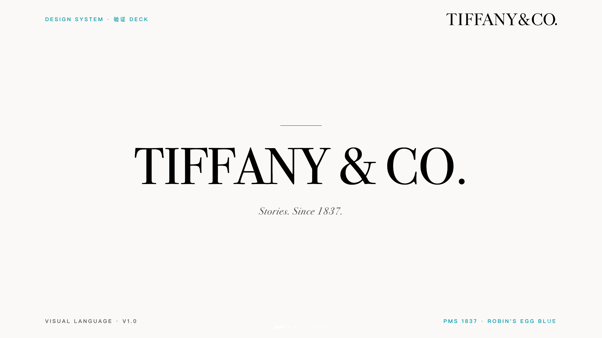 | 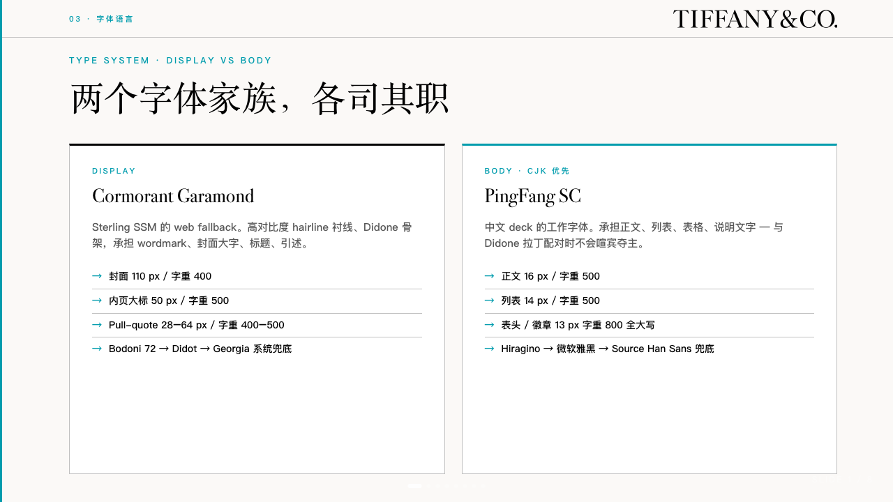 |

### Stripe
*工程精度，Söhne 风 sans，强紫色渐变。*
[打开 deck →](decks/stripe/) · [DS markdown](decks/stripe/stripe-PPT-Design-System.md)

| 封面 | 内页 |
|:---:|:---:|
| 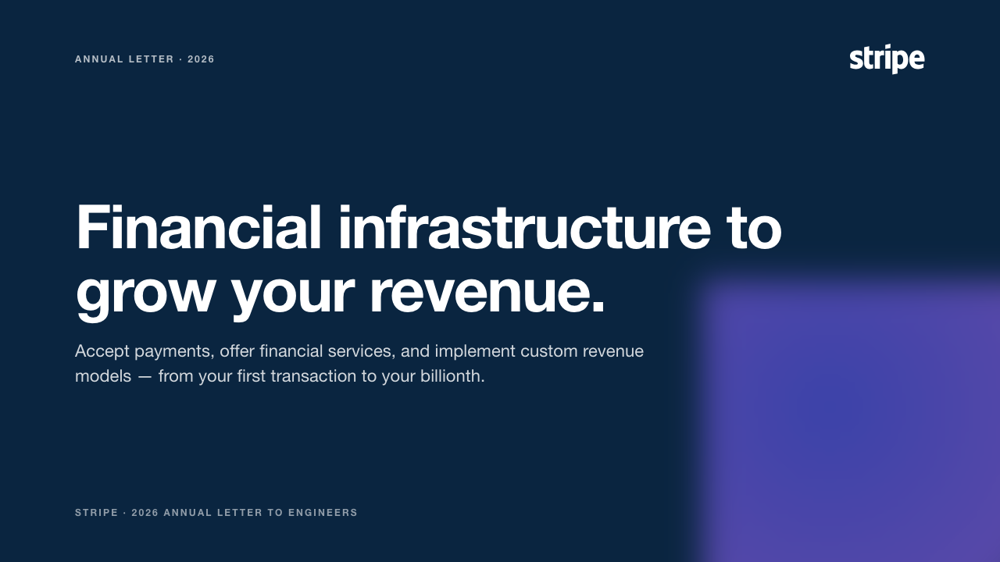 | 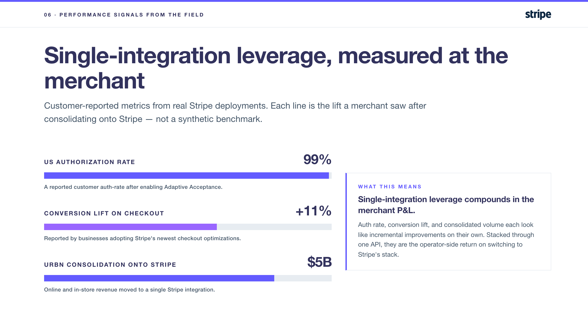 |

### Unilever（联合利华）
*温暖人文，可持续叙事，自定义字体。*
[打开 deck →](decks/unilever/) · [DS markdown](decks/unilever/unilever-PPT-Design-System.md)

| 封面 | 内页 |
|:---:|:---:|
| 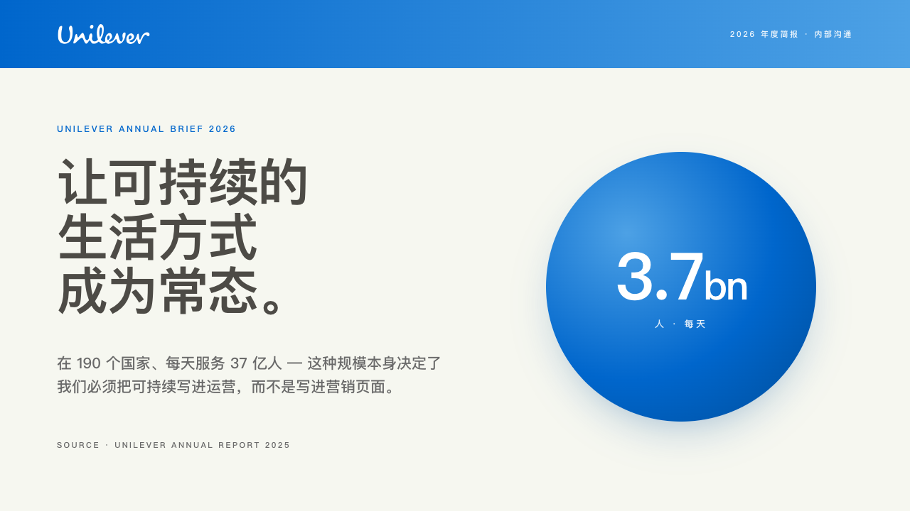 | 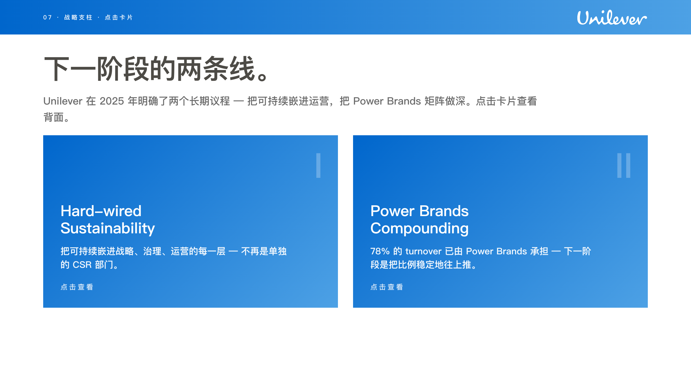 |

### P&G（宝洁）
*企业蓝，渐变 logo 徽章，从容 chrome。*
[打开 deck →](decks/pg/) · [DS markdown](decks/pg/pg-PPT-Design-System.md)

| 封面 | 内页 |
|:---:|:---:|
| 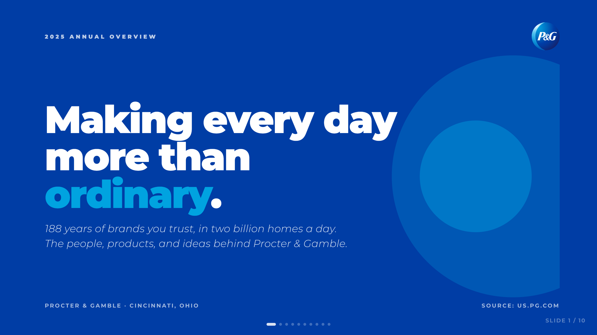 | 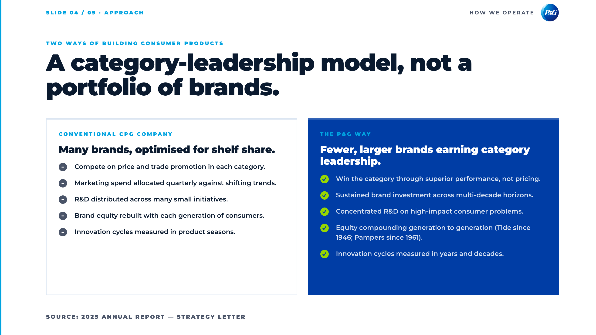 |

### Coca-Cola（可口可乐）
*编辑式遗产，Georgia 衬线，深红。*
[打开 deck →](decks/coca-cola/) · [DS markdown](decks/coca-cola/coca-cola-PPT-Design-System.md)

| 封面 | 内页 |
|:---:|:---:|
| 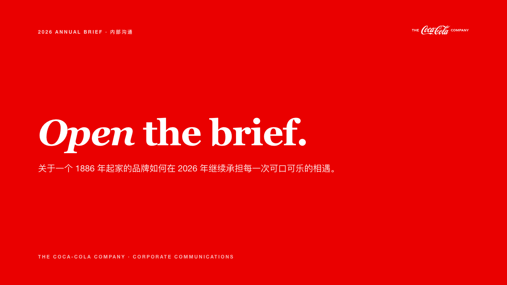 | 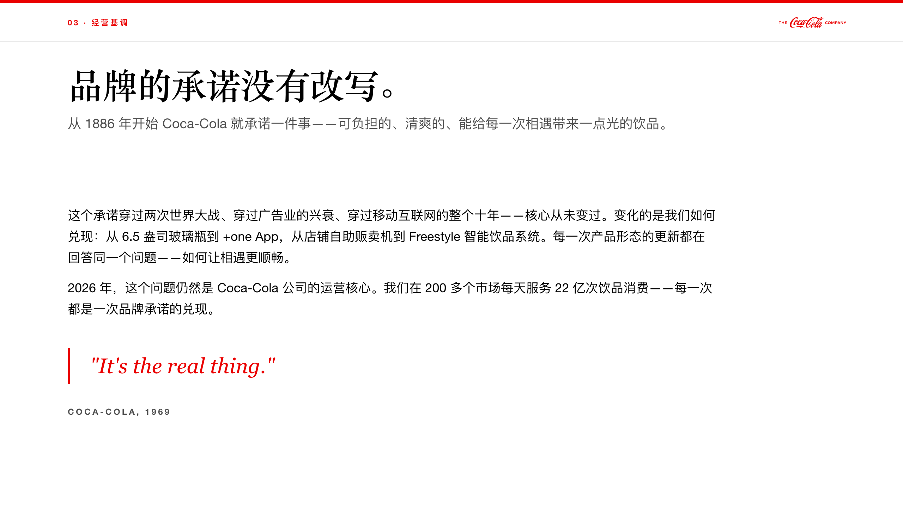 |

### Mars（玛氏）
*自信企业，多事业部调色，结构化网格。*
[打开 deck →](decks/mars/) · [DS markdown](decks/mars/mars-PPT-Design-System.md)

| 封面 | 内页 |
|:---:|:---:|
| 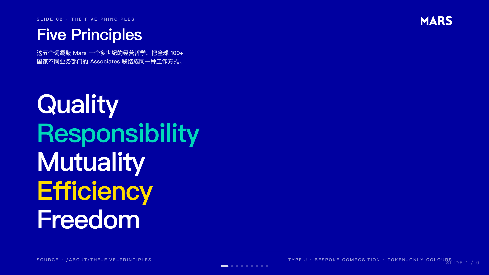 | 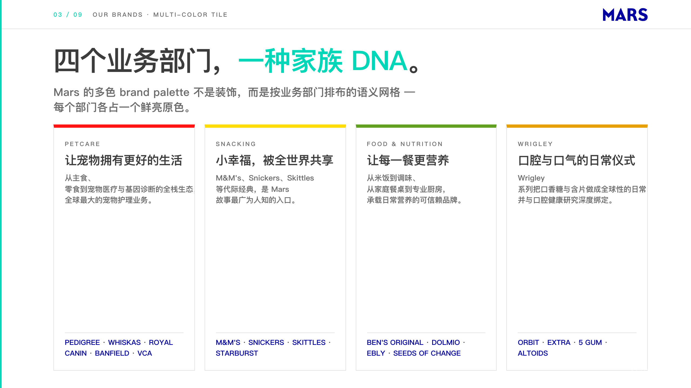 |

### L'Oréal（欧莱雅）
*法式时尚编辑感，高对比衬线，杂志感时刻。*
[打开 deck →](decks/loreal/) · [DS markdown](decks/loreal/loreal-PPT-Design-System.md)

| 封面 | 内页 |
|:---:|:---:|
| 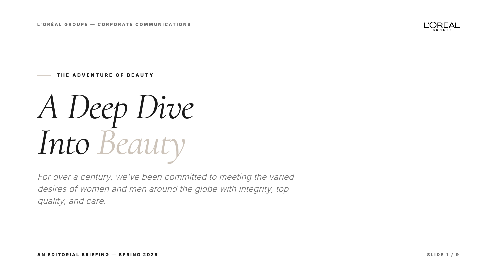 | 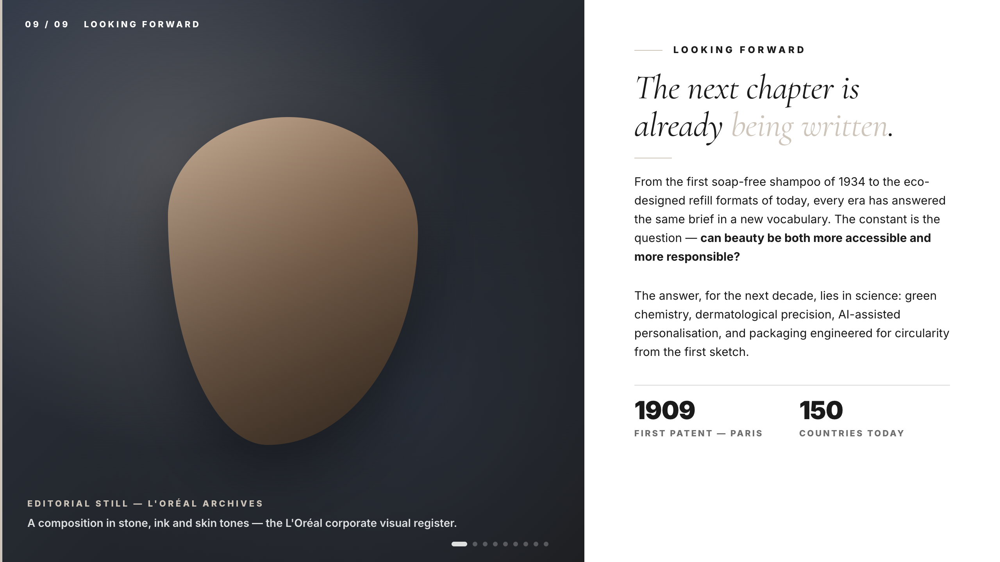 |

### 小米（Xiaomi）
*科技自信，克制的橙色 accent，紧凑的产品页节奏。*
[打开 deck →](decks/xiaomi/) · [DS markdown](decks/xiaomi/xiaomi-PPT-Design-System.md)

| 封面 | 内页 |
|:---:|:---:|
| 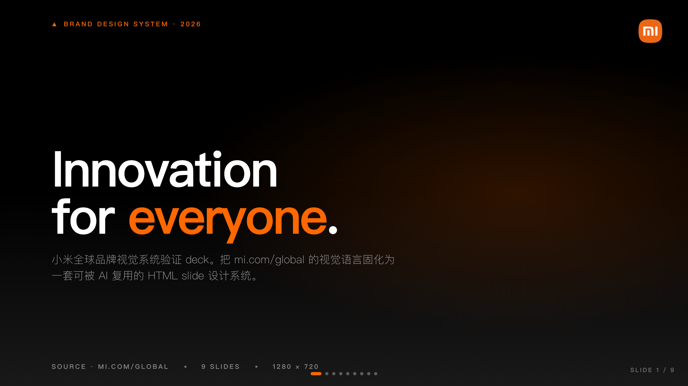 | 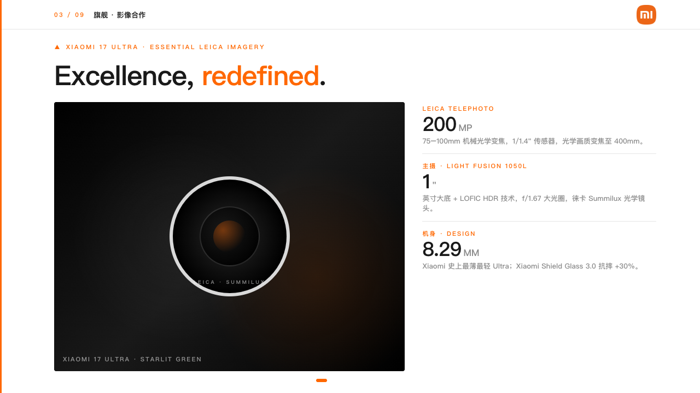 |

---

## 安装

deckify 是一个标准的 agent skill（`skills/deckify/SKILL.md`）。最快的安装方式是用开源的 [`skills`](https://github.com/vercel-labs/skills) CLI —— 一条命令，支持 Claude Code、Codex、Cursor、OpenCode 等 70+ 个 agent。它会自动识别你装了哪些 agent，把 deckify 放进各自的 skills 目录。

```bash
npx skills add seacen/deckify
```

就这样。重启你的 agent，用 **"use deckify on https://example.com"** 触发。

<details>
<summary>其他安装方式</summary>

**Claude Code 插件** —— deckify 同时也是一个 Claude Code 插件（仓库里带了 `.claude-plugin/marketplace.json`）：

```bash
claude plugin marketplace add https://github.com/seacen/deckify
claude plugin install deckify
```

**手动** —— clone 仓库，把你的 host 指向 `skills/deckify/`：

```bash
git clone https://github.com/seacen/deckify.git
# 然后两选一：把 ./deckify/skills/deckify symlink 到你 host 的 skills
# 目录；或者把 skills/deckify/SKILL.md 当 context attachment 注入。
# SKILL.md 是自描述的 —— 任何 agent 看完都知道怎么驱动它。
```

</details>

### 唯一的依赖：agent-browser

deckify 像设计师一样阅读品牌网站 —— 渲染后的 DOM、computed styles、截图 —— 这些 curl 都做不到。它用独立的 [`agent-browser`](https://github.com/vercel-labs/agent-browser) CLI 来完成。装完 skill 后，验证一下它在不在：

```bash
python3 <安装路径>/skills/deckify/scripts/setup.py
```

如果 `agent-browser` 不在 PATH，脚本会给出对应平台的安装命令（npm / brew / cargo）。让你的 agent 帮你跑即可。

---

## 一次运行长什么样

```
你:        use deckify on https://www.your-brand.com

deckify:  （第 1 阶段）读首页 + 5–8 个子页，截图，提取颜色/字体/logo
          （第 2 阶段）就那 1–2 个真的不确定的点问你（语言、有歧义的 logo 等）
          （第 3 阶段）写出 ~/deckify/decks/<品牌>/<品牌>-PPT-Design-System.md
          （第 4 阶段）搭出 ~/deckify/decks/<品牌>/<品牌>-deck.html
          （第 5 阶段）跑 11 项硬检查 + 给自己的视觉质量打分
          （第 6 阶段）把两份文件 + 一页摘要交给你
```

总耗时：**大多数品牌 5–10 分钟**，反爬严的网站会再长一点。

输出**永远**落在 `~/deckify/decks/<品牌>/`，无论你从哪个目录运行命令。

---

## 文件落在哪里

```
~/deckify/                          ← 你生成的所有品牌输出
└── decks/
    └── <品牌>/
        ├── <品牌>-PPT-Design-System.md   ← 主交付物
        ├── <品牌>-deck.html              ← 示范 deck，浏览器直接打开
        └── source/                        ← logo、品牌画像、抓取的页面
```

每次运行的报告（截图、通过/失败日志）落在 `~/deckify/reports/runs/<时间戳>/`。

---

## 这个仓库里有什么

| 文件夹 | 是什么 |
|---|---|
| [`skills/deckify/`](skills/deckify/) | skill 本体 —— 装到你机器上的内容 |
| [`decks/`](decks/) | 8 个参考品牌的输出，作为学习材料 |
| [`tools/phase-a/`](tools/phase-a/) | 维护者专用 —— 用来持续打磨 skill |
| [`TESTING.md`](TESTING.md) | 双层测试模型（skill 整体质量 vs 单个 deck 质量）|

---

## 协议

[**PolyForm Noncommercial 1.0.0**](LICENSE) —— 个人、教育、研究、慈善和非商业用途免费使用。**商业用途需要单独授权。** 必须署名：再分发或基于 deckify 二次开发时必须保留 LICENSE 文件。

如果不确定你的使用是不是「非商用」，请在 GitHub 提 issue 询问。

---

## 致谢

由 **Xichang (Seacen) Zhao** 创建 —— [github.com/seacen](https://github.com/seacen)。Engineering DNA 提炼自数次失败的 slide。`references/ds-template.md` 里的每一行都来自一次真实的生产 bug。

特别致谢我的双胞胎弟弟 **[@park0er](https://github.com/park0er)** —— 他是把我领进 AI 的那个人。今年春节前的某个下午，在他家里，他第一次让我看到 OpenClaw 在做的事 —— 那是我在 AI 这条路上的第一次心动。后来某天，他又随手分享了一份 AI 用 HTML 做的 slide。我才意识到 —— 原来 AI 真的能做出"漂亮"的幻灯片。没有他的两次"顺手一指"，就没有 deckify。

---

## One more thing —— 一封写给 AI 时代的信

留意一下刚才发生了什么。你没打开 PowerPoint。你没挪过一个文本框。你没和模板较劲。PPT 是**为「人手绘」而设计的** —— 每个方块、每段渐变、每行间距，都靠手摆。这在过去五十年里讲得通。

但 slide 的制作方式变了。slide 不再被「画」出来，它们被**想象出来、描述出来**。创作者已经从人变成了 AI，而 AI 的母语不是 `.pptx` 二进制 —— 是 HTML。活的标签、可动画、可被查询、可被改写、可粘贴进任何对话。PPT 拖慢 AI 的地方，HTML 让 AI 跑起来。

deckify 存在的意义就在这里。它不是「一个更好的做 slide 的工具」 —— 它是**让 AI 能做 slide 的那份资产**，在 AI 与生俱来的媒介里。把品牌的规范建一次；之后每一份 deck，都让 AI 来写。

欢迎来到 AI 时代的 deck。

—— deckify
